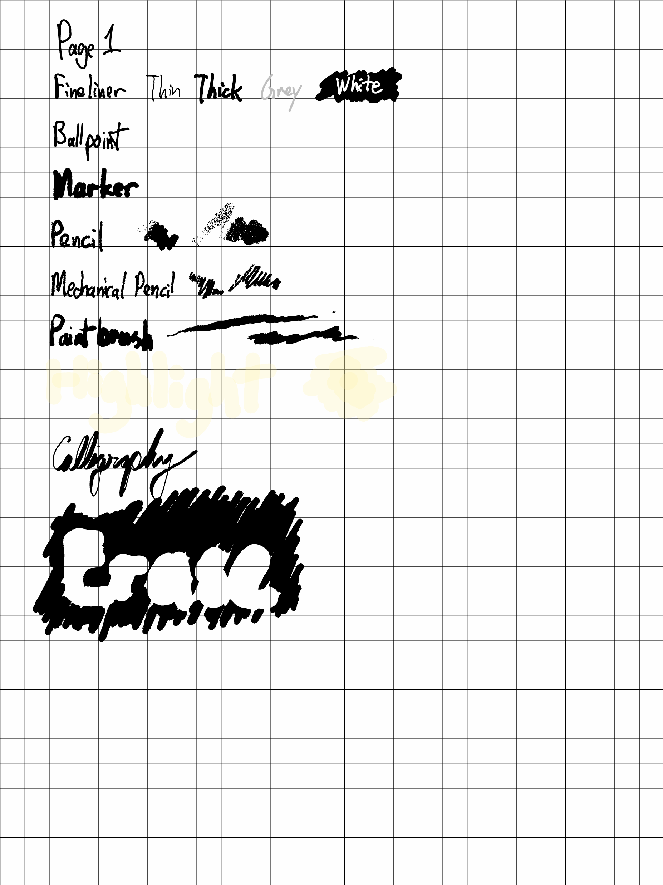
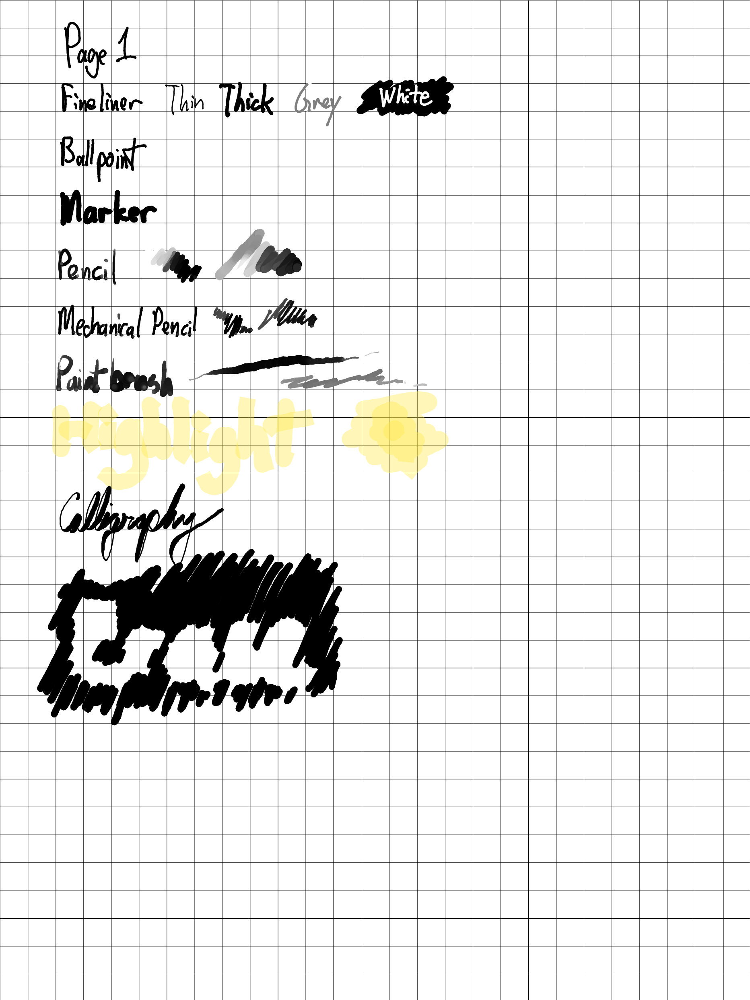

rmrl: reMarkable Rendering Library
===================================
rmrl is a Python library for rendering reMarkable documents to PDF files.
It takes the original PDF document and the files describing your annotations,
combining them to produce a document close to what reMarkable itself would
output.

Demo
----
The same notebook was rendered to a PDF via the reMarkable app and rmrl.
The resultant PDF files were converted to PNGs with ImageMagick at 300
dpi.

 reMarkable output | rmrl output
:-----------------:|:-----------:
[](demo/app.png) | [](demo/rmrl.png)

The biggest differences are the lack of texture in the pencils and paintbrush,
which we hope to address in the future.  The highlight color is also different,
but we feel the default color is too subtle.

Installation
------------
rmrl requires Python 3.7 or later.  If that's installed, the easiest installation
is to do a
```bash
pip install rmrl
```
Alternatively, you may clone this repository.  [Poetry](https://python-poetry.org/) is used for development, so once that is installed you can run
```bash
poetry install
```
to get a virtual environment all set up.

Usage
-----
The main interface to rmrl is through a single function:
```python
from rmrl import render

output = render(source)
```
`source` may be:
- The filename of a zip file containing the document.
- The filename of any (root-level) file from an unpacked document.
- Any object that provides `open()` and `exists()` methods.  See
  `rmrl/sources.py` for more details on this API.

The output is a filestream with the contents of the PDF file.

The `render` function takes the following keyword arguments:
- `progress_cb`: A callback function to be called periodically during the
  rendering process.  It will be called with a single argument, a number
  from 0 to 100 indicating the progress.  This function can abort the
  process by raising an exception.

Command-line Usage
------------------
rmrl may be called as a command-line tool.  Once it has been installed, run
```bash
python -m rmrl filename
```
to convert `filename` to an annotated PDF.  The default output is to stdout.
Use
```bash
python -m rmrl -h
```
to see all of the options.

Templates
---------
rmrl can use the reMarkable templates as a background when rendering notebooks.
We cannot ship copies of these templates.  You may be allowed to copy them from
your own reMarkable device on to your computer for personal use.  If this is
legal in your jurisdiction, you may connect your device to your computer by the
USB cable and run
```bash
python -m rmrl.load_templates
```
This will copy these templates to `~/.local/share/rmrl/templates` (assuming
default XDG settings).

History
-------
rmrl derives from the [reMarkable Connection Utility](http://www.davisr.me/projects/rcu/),
by Davis Remmel.  RCU is a full-featured GUI for managing all aspects of a
reMarkable device.  Do check it out if you are looking for a stand-alone
solution for getting documents on and off of your device.

RCU was chosen as a base for rmrl due to its high-quality rendering.  The
following are the major changes:
- rmrl is designed as a library, for incorporation into other programs.  RCU
  is designed as a stand-alone program.
- rmrl uses the pure-Python [ReportLab Toolkit](https://www.reportlab.com/dev/opensource/rl-toolkit/)
  for rendering PDF files.  RCU uses the Qt framework, which is a significantly
  heavier installation.
- rmrl only supports vector output, while RCU offers both raster and vector
  rendering.
- RCU supports PDF layers (Optional Content Groups).  At this point, rmrl does
  not.
- RCU can add PDF annotations corresponding to highlights.  At this point, rmrl
  does not.

Trademarks
----------
reMarkable(R) is a registered trademark of reMarkable AS. rmrl is not
affiliated with, or endorsed by, reMarkable AS. The use of “reMarkable”
in this work refers to the company’s e-paper tablet product(s).

Copyright
---------
Copyright (C) 2020  Davis Remmel

Copyright 2021 Robert Schroll

This program is free software: you can redistribute it and/or modify
it under the terms of the GNU General Public License as published by
the Free Software Foundation, either version 3 of the License, or
(at your option) any later version.

This program is distributed in the hope that it will be useful,
but WITHOUT ANY WARRANTY; without even the implied warranty of
MERCHANTABILITY or FITNESS FOR A PARTICULAR PURPOSE.  See the
GNU General Public License for more details.

You should have received a copy of the GNU General Public License
along with this program.  If not, see <https://www.gnu.org/licenses/>.
